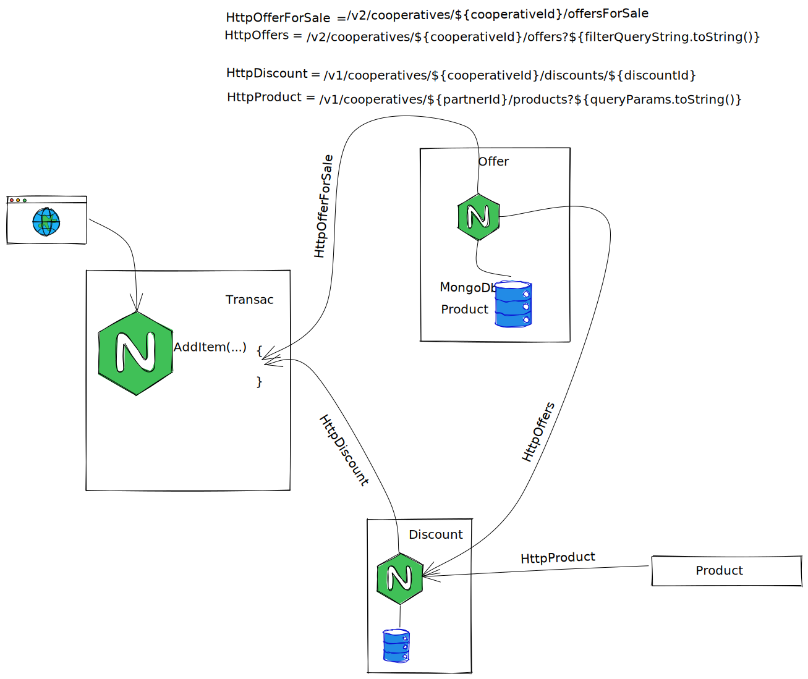

# BUS Messagerie Vs RESTful HTTP

Commencons par la situation des contextes 

<u>**UpStream / DownStream**:</u> permet d'indiquer qui contient le service.

<u>**Conformiste**:</u> Nous devons nous conformer à l'api du "Client"  
<u>Exemple:</u> Discount/Offre c'est bien offre qui donne ces informations et Discount se conforme.
Discount n'a pas demandé à Offre une modification pour avoir une api specifique

##Méthode RESTful HTTP 

### Avantage REST
> 1. Protocole connue par tous (POST,GET,...)
> 2. Facile à démarrer (nouvelle entrée dans l'équipe)
> 3. Pas de paramétrage spécifique OPS

## Inconveniant
> 1. Coupure reseau (blocage de l application)
> 2. Latence

###<u>Enregistrement d'une remise</u>

Voici le chemin d'enregistrement et visualisation d'une remise

Quand l'offre change (par exemple d unité) l api discount n est pas au courant
Du coup a chaque affichage des remises nous devons appeler Offre, cela a 1 conséquence importante
**un fort couplage avec offre**

cela peut avoir une importance sur l api discount:

* l'indisponibilité de l'application (sans lien avec les remises)

* les temps de reponses

La modification d'une offre 

la modification n est pas connue par discount donc a chaque fois que l on voudra afficher une remise avec les offres associées 
Discount sera oblige de faire appel l api Offer

###<u>Appel d'API depuis Transac</u> 

<u>Nous constatons lors de l'ajout d'un article dans le panier qu'il y a 2 appels d'api (est plus):</u>

 1. Offer.
 2. Discount (appels) :
    1. Offre (à nouveau) pour connaitre toutes les offres rattachées
    2. Produit.
    
Nous pouvons constater un appel redondant a Offre qui peut "provoquer un ralentissement" (latence ou coupure) du traitement.

##Methode bus de messagerie

## Avantage BUS

> 1. Couplage faible entre les contextes
> 2. Pas de perte d'evenement
> 3. Amélioration des temps réponses

## Inconveniant

> 1. Possible d'avoir des données non synchronisées a un instant T
> 2. Mise en place chez les OPS et refacto (des api actuelles)

###<u>Enregistrement d'une remise</u>

Dans ce cas l'enregistrement ne change pas

Affichage

La modification d'une offre

###<u>Appel d'API depuis Transac</u>

<u>Nous constatons lors de l'ajout d'un article dans le panier que nous appelons 2 api (uniquement)</u>

1. Offer.
2. Discount.

A ce jour voici notre entre les contextes 

## Couplage Faible

plus aucun context ne dépend d'un autre.

## Blocage de plusieurs API

A finaliser

// SQS => Service Bus (Plus grosse file d'attente) ou Service Bus (MaaS)
